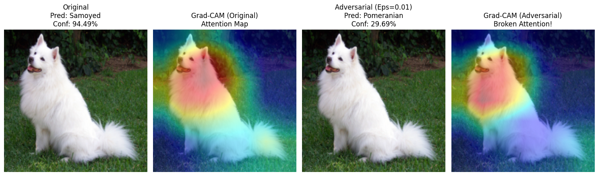
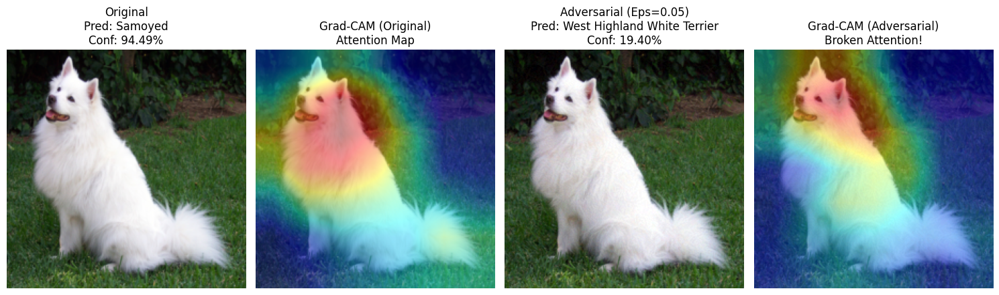
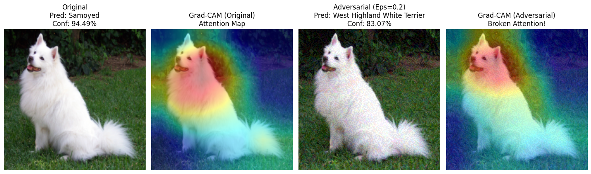

# XAI-Robustness-Demo
# Visualizing Adversarial Robustness: ResNet50 & Grad-CAM

## 📖 Introduction

This project demonstrates the vulnerability of Deep Convolutional Neural Networks (CNNs) to **Adversarial Attacks** and visualizes the model's decision-making process using **Explainable AI (XAI)** techniques.

By applying the **Fast Gradient Sign Method (FGSM)** to a pre-trained **ResNet50**, we generate adversarial examples that are imperceptible to the human eye but cause the model to misclassify with high confidence. We then use **Grad-CAM (Gradient-weighted Class Activation Mapping)** to visualize how the model's attention shifts from relevant features to adversarial noise.

## 🚀 Key Features

* **Model Architecture**: ResNet50 (Pre-trained on ImageNet).
* **Adversarial Attack**: FGSM (White-box attack) implementation.
* **Explainability**: Grad-CAM implementation with backward hooks to capture gradient flows.
* **Visualization**: Side-by-side comparison of original images, adversarial examples, and their respective attention heatmaps.

## 📊 Demo Results

Below are some important demonstration of the attack on a "Samoyed" (dog) images, while $epsilon$ varies from 0.01 to 0.2)

> **Observation**: 
> * **Left**: The model correctly identifies the Samoyed with high confidence. The Grad-CAM heatmap focuses on the dog's facial features.
> * **Right**: After adding imperceptible noise ($\epsilon = from 0.01 to 0.20$), the model misclassifies the image as a "West Highland White Terrier" (or other class), $\epsilon$ from 0.01 to 0.04(misclassified as pomeranian), conf goes down. However, $\epsilon$ from 0.05 to 0.20(misclassfied as West Highland White Terrier), conf goes up . Crucially, the Grad-CAM heatmap shows a **broken attention mechanism**, where the model focuses on irrelevant background textures rather than the object itself.

## 🔧 Methodology

### 1. Fast Gradient Sign Method (FGSM)
FGSM generates adversarial examples by adding a small perturbation $\epsilon$ in the direction of the loss gradient with respect to the input image $x$:

$$x_{adv} = x + \epsilon \cdot \text{sign}(\nabla_x J(\theta, x, y))$$

Where:
* $\theta$: Model parameters (constant during attack).
* $J$: Loss function (Cross-Entropy).
* $y$: True label.

### 2. Grad-CAM
We compute the importance map by utilizing the gradients of the target class flowing into the final convolutional layer of the ResNet50 (Layer 4).

## 🛠️ Usage

### Running on Google Colab
The easiest way to run this demo is via Google Colab. Click the badge at the top of this README.
